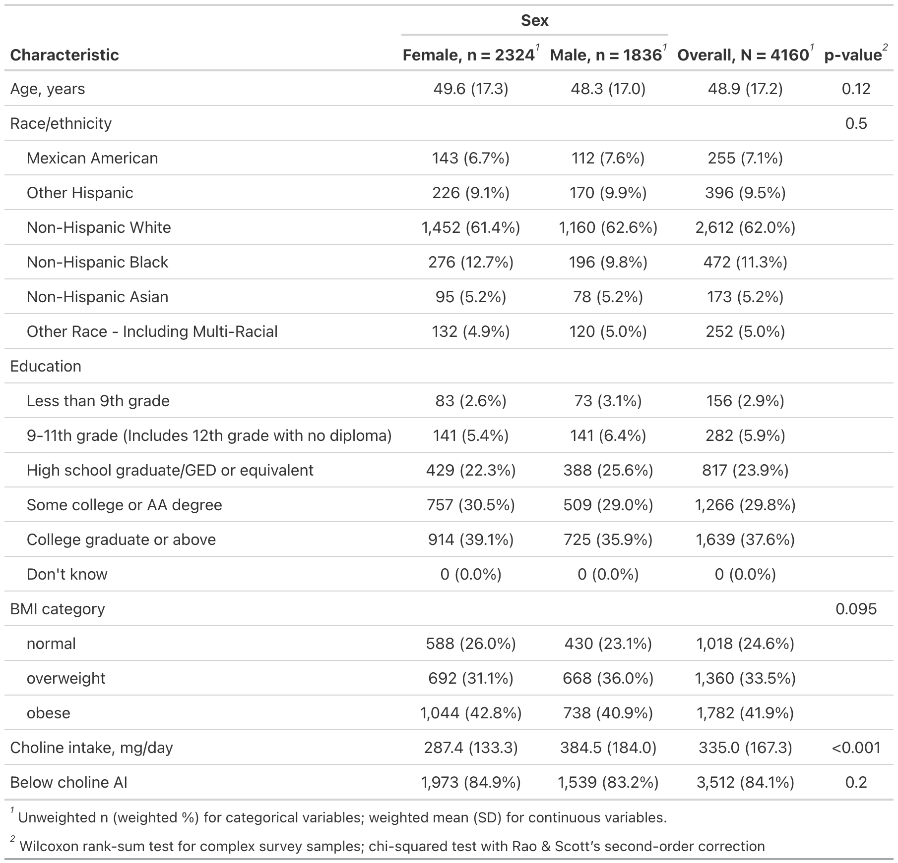
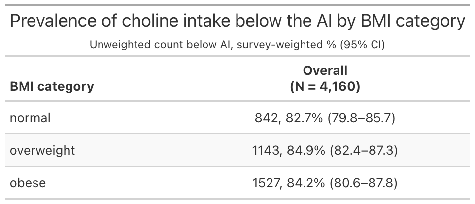
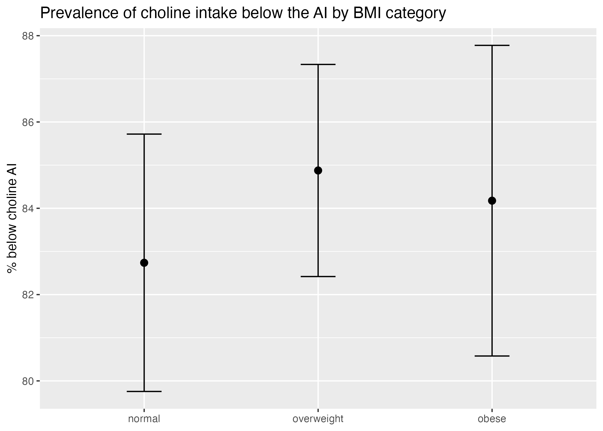
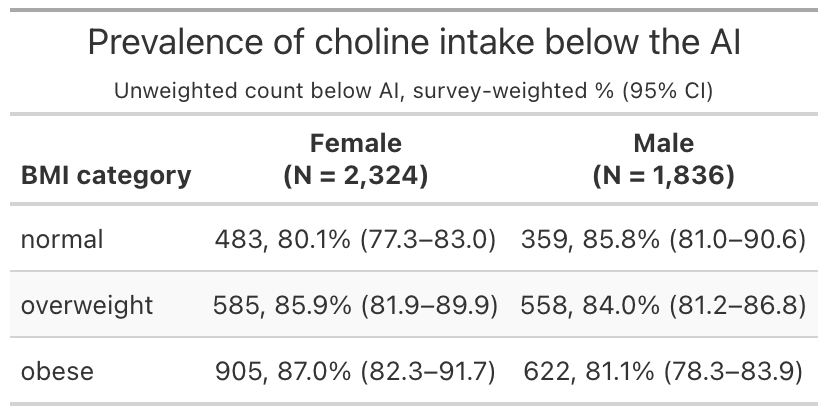
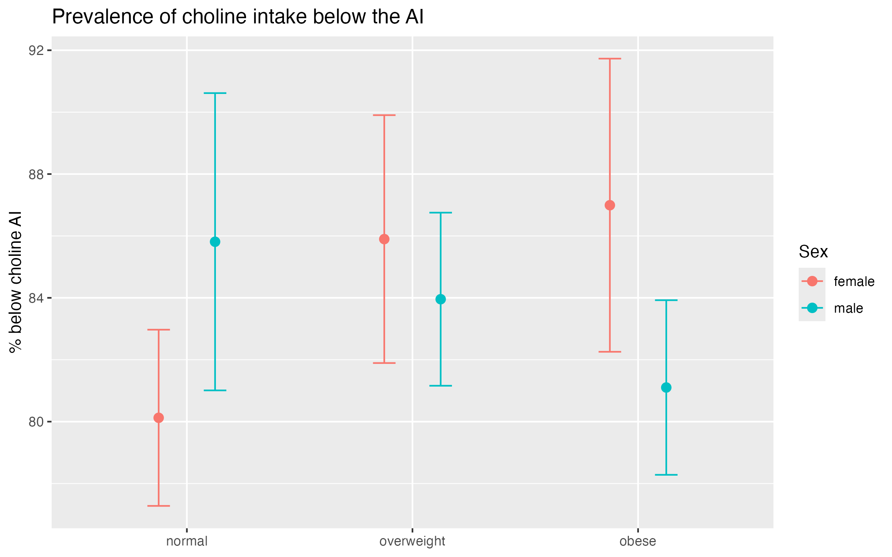
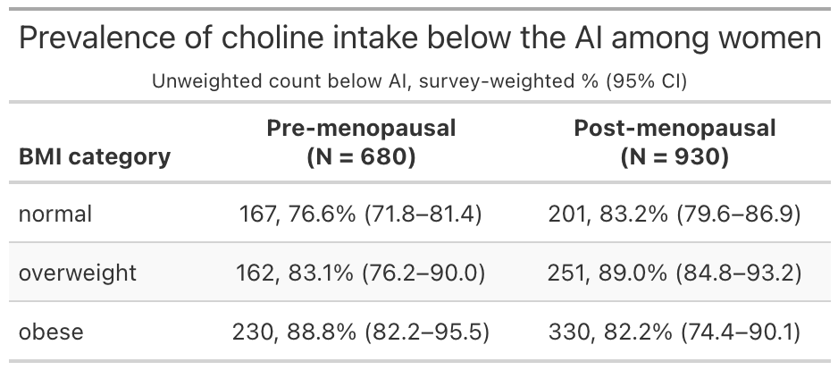
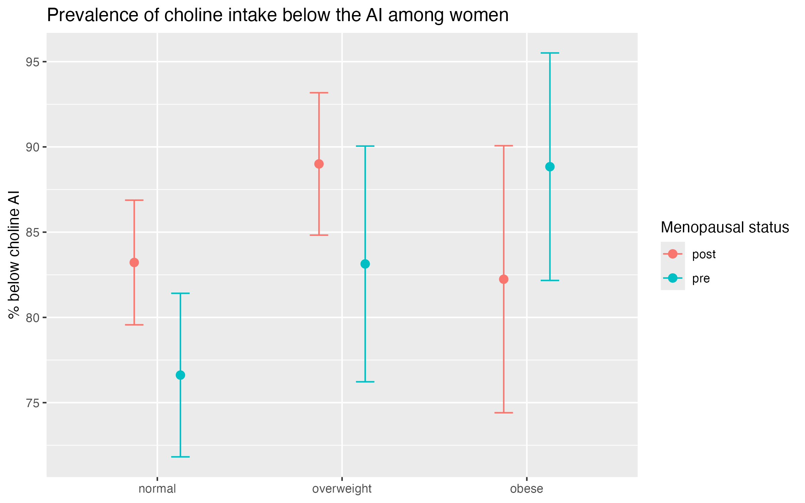

## Summary

This memo reports the final status of the summer semester of the MSPH final the project examining dietary choline intake, BMI, and liver enzyme levels in U.S. adults (NHANES August 2021 to August 2023). The project is on track and will continue through the fall.

The question and design are settled, the data are obtained and cleaned, the analytic sample is characterized, and the analysis code is written.

Aim 1 is complete and its results are reported below. What remains is running and interpreting the Aim 2 models and writing up the findings.

Two decisions have changed since the last checkpoint: I am not preregistering on OSF, and I am no longer treating Aim 2 as conditional on a feasibility check.

For full access to the datasets, code, and plots, please visit this github repository: <https://github.com/LouieNeri/MSPH-Final-Project-Choline-BMI>

## Final Research Question

Among U.S. adults, does the prevalence of dietary choline intake below the Adequate Intake (AI) differ by BMI category, and is the association between choline intake and liver enzyme levels (ALT, AST, GGT) modified by BMI?

- **Aim 1 (primary):** whether the proportion of adults with choline intake below the AI differs by BMI category, stratified by sex and menopausal status.
- **Aim 2 (secondary):** whether BMI modifies the association between choline intake and liver enzyme levels.

## Progress Against Planned Next Steps

### 1. Preregistration and the transparency approach

**Decision: not preregistering on OSF.** The prior plan was to preregister before analyzing the data. I decided the formal OSF process was more burdensome than warranted for a project of this scope and timeline.

Instead, the work is kept transparent through version-controlled, shared analysis code. The data pull, the cleaning and exclusion rules, and every model are written out in scripts that anyone can inspect and rerun, in a public repository.

[https://github.com/LouieNeri/MSPH-Final-Project-Choline-BMI/](https://github.com/LouieNeri/MSPH-Final-Project-Choline-BMI/blob/main/code/03_aim_1_analysis.R)

### 2. Obtain, clean, and merge the data; assess the analytic sample

The NHANES August 2021 to August 2023 files were obtained directly through the `nhanesA` package, merged, and cleaned, with the study variables derived and inclusion/exclusion rules applied. The survey design is declared on the full sample and the analytic samples are taken as design subsets, following NCHS guidance, so that the stratum and PSU structure is retained for variance estimation.

Exclusions.

| Stage                                 | N      |
|---------------------------------------|--------|
| Full merged file                      | 11,933 |
| Adults aged 20+                       | 7,809  |
| Aim 1 analytic sample                 | 4,238  |
| Aim 1 sample used for BMI comparisons | 4,160  |
| Aim 2 analytic sample                 | 3,851  |

The large drop into the Aim 1 sample is mostly participants without two valid dietary recall days, which is expected given that usual-intake estimation requires both days. The further drop to 4,160 removes underweight adults (n = 78), whose cell was too small to support a stable weighted estimate; all BMI comparisons below use this sample.

*Inclusion criteria*: The Aim 1 sample includes non-pregnant, non-lactating adults aged 20 and older with two valid 24-hour dietary recalls and a measured BMI.

*Exclusion criteria*: Participants with implausible energy intake on either recall day (below 500 or above 8,000 kcal/day for men; below 500 or above 5,500 for women) are excluded.

The Aim 2 sample applies the same criteria and additionally requires a measured ALT value. It excludes participants with active hepatitis, self-reported liver disease, or heavy alcohol use (more than two drinks per day on average for men, more than one for women), because these conditions raise liver enzymes independently of diet and would confound the choline-enzyme association.

Baseline characteristics are shown in @tbl-baseline. The sample is 2,324 women and 1,836 men, mean age 48.9 years (SD 17.2). Weighted mean choline intake is 335.0 mg/day overall, 287.4 among women and 384.5 among men. Because the AI is also sex-specific (425 mg/day for women, 550 for men), the sexes end up with similar shortfall prevalence despite the large difference in absolute intake. Two in five adults in the sample are obese (41.9% weighted).

::: {#tbl-baseline}

Baseline characteristics of the Aim 1 analytic sample, by sex. Unweighted n with survey-weighted percentages; weighted mean (SD) for continuous variables.
:::

Baseline characteristics of the Aim 1 analytic sample, by sex.

### 3. Run Aim 1 (primary) and Aim 2

Aim 1 is complete; results are in the next section.

**Decision: proceeding with Aim 2 unconditionally.** Aim 2 was originally gated behind a feasibility check on the choline and BMI distributions, to be evaluated without looking at the liver enzyme outcomes. I am dropping the gate and fitting the interaction models regardless. The reasoning is that a null or imprecise interaction is itself an informative result for this question. It may be more feasible to also have more detailed conversations around this model, as this would require a bit more technical nuance.

### 4. Draft the introduction

I did not draft the introduction, as I spent most of my time ensuring that the data was properly cleaned and analyzed for the initial prevalence results.

## Aim 1 Results

All estimates are survey-weighted and account for the NHANES stratified multistage design. Cells report the unweighted count below the AI with the weighted percentage and its 95% confidence interval.

Choline intake below the AI is close to universal in this population. Overall, 84.1% of adults (3,512 of 4,160) had usual intake below the sex-specific AI.

Prevalence by BMI category is shown in @tbl-prev-bmi and @fig-prev-bmi. The three categories are within about two percentage points of one another (normal 82.7%, overweight 84.9%, obese 84.2%) and the confidence intervals overlap substantially.

::: {#tbl-prev-bmi}

Prevalence of choline intake below the AI, by BMI category.
:::

{#fig-prev-bmi}

The sex-stratified results are in @tbl-prev-sex and @fig-prev-sex. The two sexes trend in opposite directions across BMI category. Among women, prevalence rises from 80.1% at normal weight to 87.0% among those with obesity; among men it falls from 85.8% to 81.1%. The confidence intervals overlap at every category.

::: {#tbl-prev-sex}

Prevalence of choline intake below the AI, by BMI category and sex.
:::

{#fig-prev-sex}

Among women, prevalence is further stratified by menopausal status in @tbl-prev-meno and @fig-prev-meno. This comparison uses 1,610 of the 2,324 women; the remainder had a hysterectomy or a status that could not be determined. Premenopausal women at normal weight have the lowest prevalence observed anywhere in the analysis (76.6%), and premenopausal prevalence rises steeply with BMI (76.6%, 83.1%, 88.8%). The postmenopausal prevalence are generally similar, (83.2%, 89.0%, 82.2%), with generally wide confidence intervals.

::: {#tbl-prev-meno}

Prevalence of choline intake below the AI among women, by BMI category and menopausal status.
:::

{#fig-prev-meno}

### Next Steps: Fall 2026

For the final stretch during August to December 2026. The remaining work is to finish the Aim 2 models, run sensitivity analyses, and write up the project for final submission. With further considerations and additional analyses as conversations go on through the semester.

Plots and tables are currently preliminary, and will be updated for proper formatting.
